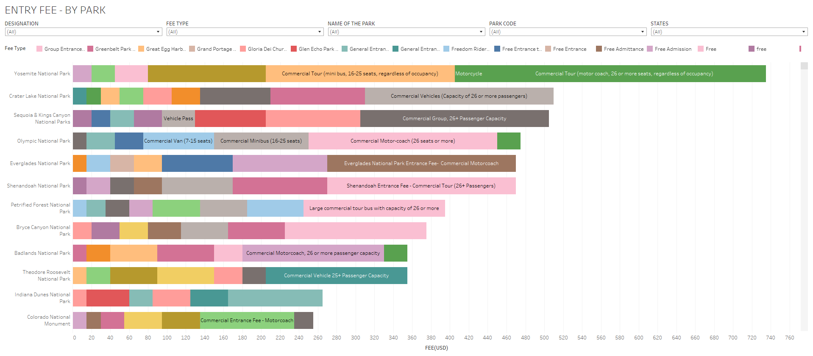

# National-Park-Service-NPS
There are two parts of this project
1. Python project to harvest parking fee of parks,National Historical Parks, National Heritage Areas using REST APIs  

Fields/Features extracted There are two parts of this project  
ParkCode  
State  
Name of the National Park  
Type of the National Park(Designation)  
Latitude  
Longitude   
LatLong   
Fee USD   
Fee Type  
Fee Description  

2. Visualize the harvested data in Tableau and Shiny.

API Guidebook:
https://www.nps.gov/subjects/developer/guides.htm

API Endpoints and Description
https://www.nps.gov/subjects/developer/api-documentation.htm

