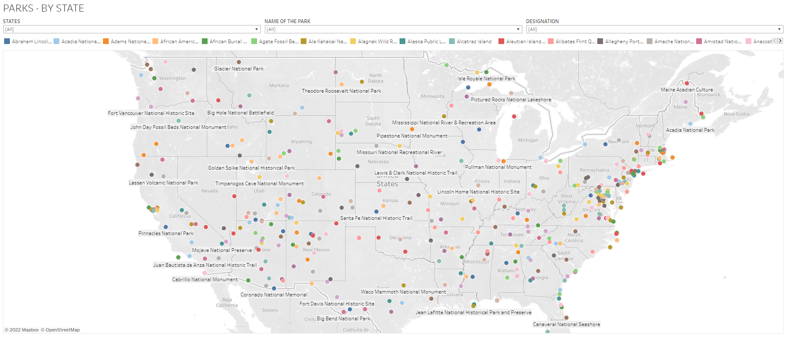

# National-Park-Service-NPS
There are two parts of this project
1. Python project to harvest parking fee of National Park, National Memorial, National Scenic Trail, National Battlefield, National Monument, National River, National Reserve, National Recreation Area using REST APIs  

Fields/Features extracted:  
a. ParkCode  
b. State  
c. Name of the National Park  
d. Type of the National Park(Designation)  
e. Latitude  
f. Longitude   
g. LatLong   
h. Fee USD   
i. Fee Type  
j. Fee Description  

2. Visualize the harvested data in Tableau and Shiny.

API Guidebook:
https://www.nps.gov/subjects/developer/guides.htm

API Endpoints and Description
https://www.nps.gov/subjects/developer/api-documentation.htm
